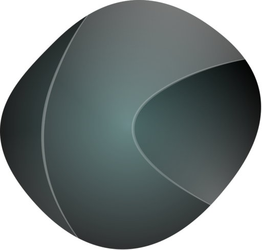

<p align="center">
  
  <h1 align="center">OnyxSDK</h1>
  <p align="center">
    <strong>Game-agnostic C++ SDK for building game-asset explorer applications.</strong>
  </p>
  <p align="center">
    <a href="https://github.com/JeanxPereira/OnyxSDK/actions/workflows/ci.yml"></a>
    
    
    
    
    
  </p>
</p>

---

Onyx is the reusable engine underneath a game-asset explorer: windowing, docking UI, a Vulkan renderer, audio, video, and a virtual filesystem — wired together so that adding support for a new game means writing a *module*, not an application. The SDK itself knows nothing about any specific game; it knows about containers, entries, decoders and scenes, and asks your module to name them.

You bring an `IGameModule` implementation. Onyx brings the window, the browser tree, the 3D viewport, the CLI, and the tests.

## Features

| Area | What it does |
|---|---|
| Module contract | `IGameModule` + `Workspace` + `DecoderRegistry` + `TypeRegistrar` — a game is registered, never hardcoded |
| Containers | `IVirtualFileSystem`/`IFile` over OS files, with mounts and 64-bit `ByteRange` addressing into nested archives |
| Shell | Dockable window with browser tree, inspector, status bar, settings, recents and theming — driven entirely by the registered `Workspace` |
| Renderer | Vulkan 1.3 (volk + VMA, dynamic rendering, sync2), offscreen-first, MSAA 4x + resolve, PBR on role-indexed materials, GPU skinning via a joint-palette SSBO, procedural grid and skeleton overlay |
| Two render floors | `SceneRendererVk` (the ready-made path most consumers want) and `RenderContext` (raw `VkDevice`/queue/command buffer + `AddPass`, for callers recording their own Vulkan work) |
| Headless render | `Onyx::Rendering::RenderToImage` — one call from a `SceneData` to RGBA pixels, no Vulkan types in the signature |
| Viewers | 3D viewport, image, material, audio, video, hex — registered through `ViewerRegistry`, opened by `ViewerRouting` |
| CLI | `probe`, `list`, `extract`, `decode` (`--to gltf`), `render` (`--views`, `--strict`) — the same code path the GUI uses |
| Exchange | glTF 2.0 export with skins, machine-verified by a `cgltf` round-trip |
| TestKit | `Onyx::TestKit` — golden comparison, decode smoke and render comparison helpers, so a consuming project gets the SDK's own test rig |
| UI Gallery | Live catalogue of every widget, theme token, icon and style knob (`--ui-test` / <kbd>F1</kbd>) |

## Platform support

Stated as verified, not as intended:

| Platform | Status |
|---|---|
| **Windows** | Verified end to end — this is where the GUI actually runs. |
| **Linux** | Implemented and green in CI (`linux-lavapipe`, software Vulkan). Presentation has never been run against a real window. |
| **macOS** | **Unsupported.** The platform window code still drives `NSOpenGLContext` from the deleted GL renderer, and `VkContext` enables neither `VK_KHR_portability_enumeration` nor `VK_EXT_metal_surface`. Real, unstarted work — see `CHANGELOG.md`'s "Known gaps". |

## Quick Start

Prerequisites: CMake 3.20+, Ninja, MSVC (Windows) or clang/GCC (Linux), and a **Vulkan 1.3-capable GPU driver**. The Vulkan loader and headers are fetched by the build; this is about the driver on the machine that runs the tests or the GUI. On Linux, FFmpeg comes from pkg-config; on Windows a prebuilt FFmpeg is downloaded during configure.

```bash
git clone https://github.com/JeanxPereira/OnyxSDK.git
cd OnyxSDK
cmake --preset debug        # or: cmake -G Ninja -DCMAKE_BUILD_TYPE=Debug -B build
cmake --build --preset debug
ctest --test-dir build --output-on-failure
```

Then run the example viewer against the example module's own synthetic container:

```bash
./build/Examples/MinimalViewer/MinimalViewer            # GUI
./build/Examples/MinimalViewer/MinimalViewer --ui-test  # UI Gallery only
./build/Examples/OnyxCli/onyxbox-cli list sample.obx    # headless
```

| Option | Default | Effect |
|---|---|---|
| `ONYX_BUILD_EXAMPLES` | `ON` | Build `MinimalViewer`, `OnyxBox`, `OnyxCli` |
| `ONYX_BUILD_TESTS` | `ON` | Build the doctest suite (`ctest`) |
| `ONYX_COMPONENT_MEDIA` | `ON` | Build `VideoPlayer` (pulls FFmpeg) |
| `ONYX_FFMPEG_WIN_URL` | pinned | Override the Windows FFmpeg archive |

## Consuming Onyx

**The supported model is source consumption via `FetchContent` or `add_subdirectory` — there is no `install()`, no `export()`, and no `find_package(OnyxSDK)` config, by design, in v1.** Onyx is built exactly once, as part of your own project's configure, from source you pin to a tag or commit; there is no separate "install Onyx system-wide, then `find_package` it from unrelated projects" step, and no prebuilt package is published. This is a deliberate scope decision, not an oversight the SDK will "get around to" — it keeps the surface honest about what actually exists rather than shipping a packaging story nobody has exercised. If a future milestone adds real `install()`/`export()` support, it will be documented here alongside the version it landed in; until then, treat any `find_package(OnyxSDK)` invocation you might see elsewhere as unsupported.

```cmake
include(FetchContent)
FetchContent_Declare(OnyxSDK
    GIT_REPOSITORY https://github.com/JeanxPereira/OnyxSDK.git
    GIT_TAG        v0.6.0)
set(ONYX_BUILD_EXAMPLES OFF CACHE BOOL "" FORCE)
set(ONYX_BUILD_TESTS    OFF CACHE BOOL "" FORCE)
FetchContent_MakeAvailable(OnyxSDK)

target_link_libraries(MyApp PRIVATE Onyx::Onyx)
# On Windows, copy FFmpeg DLLs beside your exe:
# if(WIN32 AND ONYX_FFMPEG_DLLS)
#     add_custom_command(TARGET MyApp POST_BUILD
#         COMMAND ${CMAKE_COMMAND} -E copy_if_different ${ONYX_FFMPEG_DLLS} $<TARGET_FILE_DIR:MyApp>)
# endif()
```

`add_subdirectory(path/to/OnyxSDK)` works the same way if you vendor the source directly (a git submodule, a subtree, a copied checkout) instead of using `FetchContent` — both end up calling the same root `CMakeLists.txt`.

### Targets

All under the `Onyx::` namespace. Never link the raw `Onyx_*` names — those are implementation detail, and `Examples/` follows the same `Onyx::*`-only rule.

| Target | What it is |
|---|---|
| `Onyx::Onyx` | The aggregate most consumers want — Core + Render + Shell |
| `Onyx::Core` | No UI, no GPU |
| `Onyx::Render` | The Vulkan renderer |
| `Onyx::Shell` | Windowing and UI; links Core + Render |
| `Onyx::Media` | `VideoPlayer`, only when `ONYX_COMPONENT_MEDIA` is ON |
| `Onyx::Exchange` | glTF export |
| `Onyx::CliRender` | Headless `CmdRender` — Core + Render, no UI dependency |
| `Onyx::TestKit` | Opt-in golden / decode-smoke / render-compare helpers |

### Headers

| Include | Surface |
|---|---|
| `<Onyx/Onyx.h>` | The umbrella for everything `Onyx::Onyx`/`Shell`/`Core` ships (that file's top comment states the exact inclusion rule) |
| `<Onyx/Render.h>` | The Vulkan-touching renderer surface, `Onyx::Render` alone, without the Shell |
| `<Onyx/Media.h>` | `VideoPlayer`, when `ONYX_COMPONENT_MEDIA` is on |

Splitting these three keeps a headless consumer of `Onyx::Core`/`Onyx::CliRender` from ever having to put `volk.h`, `vk_mem_alloc.h`, or FFmpeg's headers on its include path.

## CLI Usage

Every command runs against a `Workspace` that already has your modules registered, and knows nothing about any specific game format — only the `IGameModule`/`Workspace`/`DecoderRegistry` contracts. `Onyx::Cli::Run` parses argv; the example wires it to the synthetic `OnyxBox` module.

```bash
# Which registered module claims this file?
onyxbox-cli probe sample.obx

# List the container's entries (add --json for a machine-readable tree)
onyxbox-cli list sample.obx --json

# Extract every entry's raw bytes into a directory
onyxbox-cli extract sample.obx ./dump

# Decode one entry, optionally through an exporter
onyxbox-cli decode sample.obx mesh0 --strict
onyxbox-cli decode sample.obx mesh0 --to gltf --out model.gltf

# Render a decoded scene headlessly, from named canonical views
onyxbox-cli render sample.obx mesh0 --out shot.png --width 512 --height 512 --views iso,front,top
```

Canonical views are `iso`, `front`, `back`, `left`, `right`, `top`; `iso` is the default when `--views` is omitted. `--game <hint>` biases module selection when more than one module could claim a file.

Exit codes are a fixed vocabulary: `0` ok, `1` bad usage / entry not found / no decode capability, `2` no module accepted the file, `3` `--strict` and the document carried an `Error` diag.

## UI test mode

The SDK ships a **UI Gallery** panel: a live catalogue of everything the interface is built from, so the look can be polished without opening a single asset. Open it from **View → UI Gallery**, with <kbd>F1</kbd>, or start the example with `--ui-test`.

| Page | What it is for |
| --- | --- |
| Widgets | Every `Onyx::App::Widgets` wrapper beside the plain ImGui widget it replaces, in each state (normal, selected, disabled). |
| Theme | Live accent and Dark/Light/System switch, the toolbar tokens, and a per-colour **contrast audit** that paints each alpha-resolved surface with the label colour `TextForSurface` would pick and reports the WCAG ratio. |
| Typography | Font family and size, UI scale, a mono specimen for the hex/size columns, and live font metrics. |
| Icons | Searchable grid over all ~6.7k SF Symbols; click copies the `ICON_SF_*` macro name. Links to the glyph debugger for atlas/fallback problems. |
| Style | Live `ImGuiStyle` padding/rounding/border editors, with "Copy as C++" to paste the result into code. |
| Diagnostics | Frame and draw-call counters plus the Dear ImGui demo, metrics, style editor and ID-stack tools. |

Nothing the gallery changes is persisted — accent, scale, font and style edits last for the session only, so it is safe to wreck the theme while experimenting. Settings is what writes `onyx.toml`. Any consumer gets the panel for free; to open it programmatically:

```cpp
app.setPanelVisible("UI Gallery", true);
```

## Architecture

```
Include/Onyx/     public headers -- the SDK surface consumers include
Source/           implementation; mirrors Include/Onyx/ folder for folder
  Api/            ToolkitApi (the app-facing facade)
  App/            window shell, panels, title bar, settings, gallery
  Audio/ Container/ Domain/ Fonts/ Platform/ Rendering/ Schema/
  Services/       config, logging, tasks, theme, profiles, recents
  Types/ Vfs/ Viewers/
Examples/         MinimalViewer, OnyxBox (a synthetic module), OnyxCli
Tests/            doctest unit tests, run by ctest
Tools/            OnyxOracle -- the render corpus and parity gate
cmake/            build-time codegen (version header, SF Symbols table)
third_party/      fonts + miniaudio + stb (everything else is fetched)
docs/             design specs, plans and format notes
dist/             brand assets (Affinity source + SVG)
```

Every `Source/<X>/Foo.cpp` implements `Include/Onyx/<X>/Foo.h`; files without a public header are private to that subsystem.

### Rendering parity

The Vulkan renderer is not trusted because it looks right. `Tools/OnyxOracle` renders a frozen corpus of five synthetic scenes and compares the output against goldens on a four-knob tolerance (max channel delta, differing pixel %, high-delta pixel %, MAE), plus a byte-identical reproducibility gate. Both run in `ctest`.

## Dependencies

Everything is fetched and pinned by `CMakeLists.txt` — no submodules, and nothing vendored beyond fonts, miniaudio and stb.

| Library | Version | Used for |
|---|---|---|
| GLFW | 3.3.9 | Windowing and input |
| Dear ImGui + ImPlot | pinned commit | Docking UI and plots |
| ImGuiColorTextEdit | pinned commit | Text/hex editing |
| GLM | 1.0.1 | Math (`GLM_FORCE_DEPTH_ZERO_TO_ONE`) |
| Vulkan-Headers | v1.3.296 | Vulkan API |
| volk | vulkan-sdk-1.3.296.0 | Vulkan loader |
| VulkanMemoryAllocator | v3.1.0 | GPU allocation |
| glslang | 14.3.0 | Shaders compiled to SPIR-V at build time and embedded |
| lz4 | v1.9.4 | Decompression |
| toml++ | v3.4.0 | `onyx.toml` config |
| cgltf | v1.15 | glTF export and round-trip validation |
| doctest | v2.4.11 | Unit tests |
| miniaudio, stb | vendored | Audio playback, image I/O |
| FFmpeg | pinned / pkg-config | Video decode (`ONYX_COMPONENT_MEDIA`) |

## Stability policy

**Public surface:** everything under `Include/Onyx/**`, except any header under an `Include/Onyx/**/Detail/` directory. `Detail/` is reserved for headers that must physically live under `Include/` for build reasons (template/inline bodies, platform shims a public header `#include`s) but declare no part of the contract below — nothing under `Include/` currently needs it, but the convention exists so a future one has a place to go without ambiguity about whether it is covered. Everything under `Source/**` is implementation and carries no stability promise at all; it can change in any commit, including a patch release.

**API, not ABI.** Onyx ships as source and every consumer recompiles against the exact commit or tag they pull — there is no prebuilt binary a stale header could silently mismatch. The stability promise below is therefore about *source* compatibility (does your `#include` and call site still compile and mean the same thing), never about binary layout, symbol versioning, or struct ABI. A struct gaining a defaulted field, an enum gaining a new enumerator, or a virtual method table changing shape are all in-bounds changes at any version, because nothing links a prebuilt `.lib`/`.so` against a different Onyx commit than it was compiled with.

**Pre-1.0 (current):** anything under `Include/Onyx/**` (minus `Detail/`) may change in a breaking, source-incompatible way in a MINOR version bump (`0.X.0`), same as any pre-1.0 SemVer project. A PATCH bump (`0.6.X`) never breaks source compatibility on purpose. Breaking changes are called out in `CHANGELOG.md`.

**Post-1.0:** the public surface follows SemVer's source-compatibility reading —

- **PATCH** (`X.Y.Z+1`): bug fixes only, no signature or behaviour-contract change to any public declaration.
- **MINOR** (`X.Y+1.0`): additive only — new headers, new functions, new struct fields with defaults, new enumerators appended (never inserted) to an existing enum. Existing call sites keep compiling and keep meaning what they meant before.
- **MAJOR** (`X+1.0.0`): the only version class allowed to remove, rename, or change the meaning of an existing public declaration. Reserved for real design corrections, not routine growth — `CHANGELOG.md` documents the migration for each one.

A header moving between two public locations (for example the `Include/Onyx/RenderVk/` → `Include/Onyx/Rendering/` fold) is itself a breaking, MAJOR-class change under this policy once past 1.0; pre-1.0 it is a MINOR bump like any other breaking change, called out in `CHANGELOG.md` the same way a removed function would be.

## Conventions

- **Encoding**: UTF-8, no BOM, LF in the repository (`.gitattributes` enforces it).
- **Formatting**: `.clang-format` describes the house style (4-space indent, 100 columns, attached braces). The existing tree is deliberately not mass-reformatted, so `git blame` stays useful — format what you touch.
- **Generated code**: the SF Symbols name→glyph table is generated from `Include/Onyx/Fonts/SFSymbols.h` at build time (`cmake/GenerateIconTable.cmake`); reach it through `Onyx::Fonts::IconTable()` rather than hand-maintaining a copy.
- **Commits**: Conventional Commits, Sentence-case subject, lowercase type and scope.

## Brand assets

`dist/` holds the Affinity Designer source and two SVGs:

| File | What it is |
|---|---|
| `Logo.svg` | The full mark — layered radial gradients, for headers and app icons |
| `Glyph.svg` | The monochrome cut. Not a decoloured `Logo.svg`: the facets are redrawn as separate solids with the gradient seams turned into gaps, so the shape survives at favicon size. Single path, `fill="currentColor"` — recolour it by setting `fill`/`color`. |

Both carry a `viewBox`, so they scale to any size.

## License

MIT — see [`LICENSE`](LICENSE).
